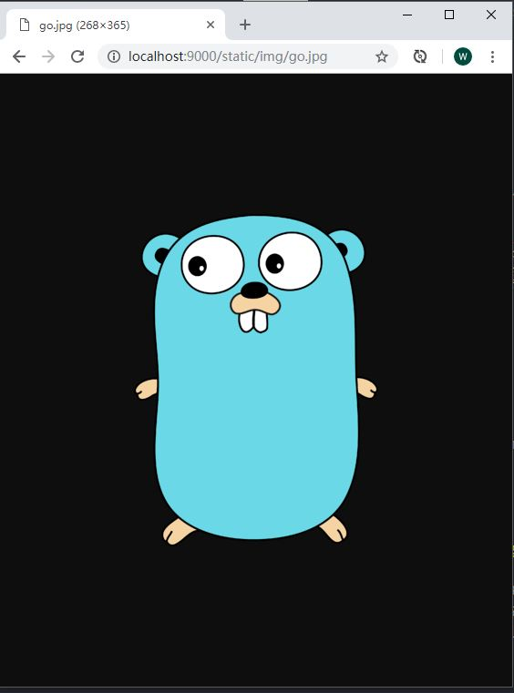

# CloudGo-IO

Service Computing Course homework: CloudGo-IO, simple web serving program based on GO language

## External Source Library

- Server-end
  [Negroni](https://github.com/urfave/negroni), customed server
  [Gorilla/mux](https://github.com/urfave/negroni), custom router
  [Render](https://github.com/unrolled/render/), custom data render for router handler
- Front-end
  [jQuery](https://api.jquery.com/), friendly `javascript` DOM operation library
  [Semantic](https://semantic-ui.com/), almostly only `css` library

## Project Structure

```
|-- CloudGo-IO
    |-- main.go
    |-- router
    |   |-- develop.go
    |   |-- home.go
    |   |-- info.go
    |   |-- login.go
    |-- service
    |   |-- server.go
    |-- static
    |   |-- css
    |   |   |-- home.css
    |   |   |-- index.css
    |   |   |-- login.css
    |   |-- img
    |   |   |-- go.jpg
    |   |-- js
    |       |-- home.js
    |       |-- index.js
    |       |-- login.js
    |-- templates
        |-- home.html
        |-- index.html
        |-- login.html
```

1. main.go 程序主入口，可设置监听端口
1. router 路由文件，存储路由函数，所有路由函数导出至router 包
1. service 服务器配置函数，设置中间件参数和服务器参数
1. static 静态文件夹，存放 css/js/img 等文件(*需要给路由配置静态文件获取的重定向，否则 404*)
1. templates 存放 html 文件(*中间件 [render 参数设置限制](https://github.com/unrolled/render#available-options)，更改参数可变更位置*)

## Test and Result

1. Static file access
    
1. JS request and json response
    
1. Form submit
    - 表单填写
      
    - 表单结果
      
1. Developing notification
    

## Summary

Go 提供的 web 的确遵循着简单，简单，再简单的原则，提供了个性化设置的自由。使用过，node/django，他们都提供了确认的框架，按照框架进行 web 服务的搭建。
在这里，完全的自由。一开始想要一个固定的框架，来告诉我，什么文件放在哪里，哪个文件处理什么内容，但是，都没有。所以，摸索着搭建出了简单的自己人之中的框架:
`main entrance -> server -> router -> static files`
这个简单框架，与 django 比较类似，有时间可以去除内部文件搭建一个框架，帮助学习 go-web，这样对新手比较友好，可以提前明确文件目录。
